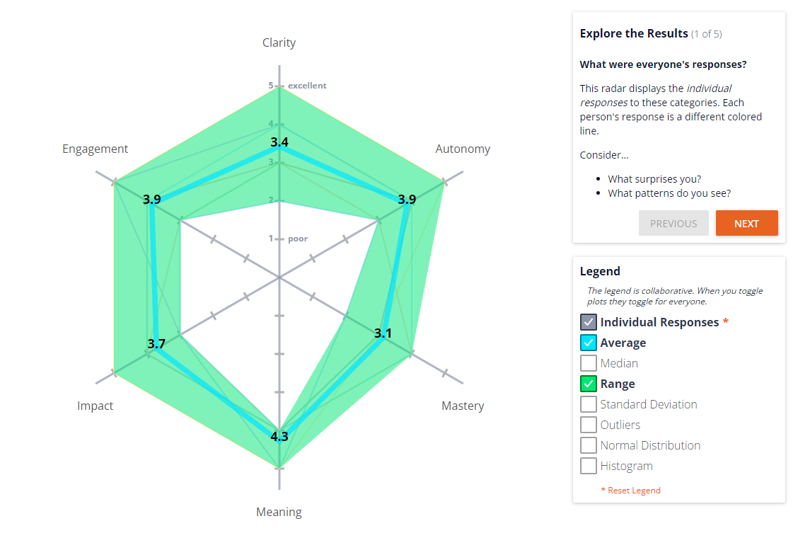

# Team Meeting
## Date: Nov 16, 2021. 1:30pm - 2:10pm
## Meeting method: zoom

### Attendence:
Antonia  
David  
Dzhangir  
Jeremy  
Niya  
Richard  
Ryan Hero  

### Main Dish:
We use Retrium for sprint retrospective meeting: [Team Radar - Work Happiness](https://app.retrium.com/team-room/3a3841c6-503d-47d9-9dcf-9bd42b866421/history) [Mad, Sad, Glad](https://app.retrium.com/team-room/9cc85e32-440f-490c-ac67-3ed52ed03c1d/history)

* Slack Communication (Mad): When post a question on slack, no one answer and no one respond:
  * Antonia: If someone is not attending the meeting, they should be notified (via slack/text/call according to personal preferences)
  * Dzhangir: People are busy, they may checked out for a few days, but when I looked into repo, things are getting done
  * Richard: we have team rule set for replying within 12 hours
  * React feature is helpful, so people feeling that not talking into void. Reply to the message should be under the message itself, so the screen is not over crowded with one issue/message thread.
  * People missing the meeting may be in the meeting if they get the message
* Zoom Meeting:
  * Dzhangir: Appreciate if meeting video can be on or there are some reactions, so he knows how to run the meeting effectively
* Bootstrap: should've have use bootstrap from the beginning [Sad] should've use bootstrap from the beginning
  * Should we refactor the UI?
  * Jeremy: maybe it is nice if we have web app that is not identical to everyone who use bootstrap
  * Richard: Q: if we use bootstrap, do we think in css or bootstrap?
  * Dzhangir: A: add minimal css, focus on function for now
* Overwhelmed: feeling inexperienced and overwhelmed at the size of the project [Sad]
  * Dzhangir: if you get stuck and frustrated, better to pair programming. Communication is important, we can Pitch idea back and forth and better chance to solve the issue. eg. in design stage, the collaboration between Jeremy and Antonia.\
* A lot get done in mob session [Glad]:
  * Continue! Yey!
  * Sunday: 12:00-4:00pm
  * Other time: Dzhangir will be in geisal lib from 3:00-5:00pm week8
* Lack of clear documentation and clear expectations
  * Dzhangir:
    * Style consistency
    * SPA or PWA
    * localstorage
  * Richard:
    * expectation should be clear
