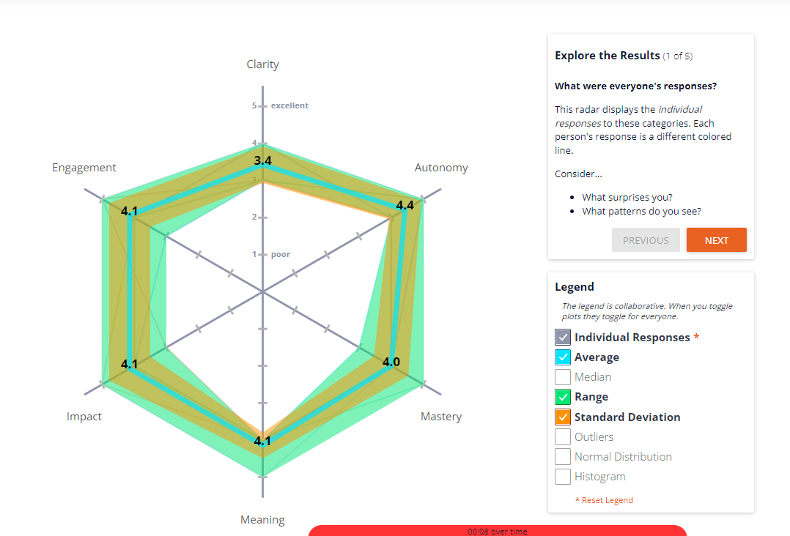
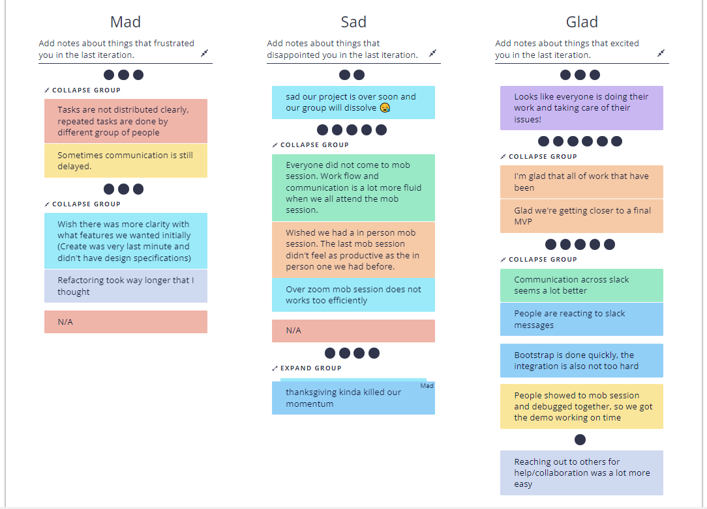

# Team Meeting
## Date: Nov 29, 2021. 5:00pm - 5:40pm
## Meeting method: zoom

### Attendence
David  
Dzhangir  
Jeremy  
Niya  
Richard  
Run Wang  
Ryan Hero  
Will Liao  

### Main Dish
We use Retrium for sprint retrospective meeting: [Team Radar - Work Happiness](https://app.retrium.com/team-room/3a3841c6-503d-47d9-9dcf-9bd42b866421/history) [Mad, Sad, Glad](https://app.retrium.com/team-room/9cc85e32-440f-490c-ac67-3ed52ed03c1d/history)

* Works are done and get into the final stage [Glad]: Glad we're getting closer to a final MVP
  * Positive Reaction!
  * Thank you everyone for your efforts
* Communication across slack seems a lot better [Glad]: People are reacting to slack messages
  * Keep doing that!
  * Reply to message on time
  * React if you see the message
* Online mob session not working [Sad]: The last zoom mob session didn't feel as productive as the in person one we had before.
  * Dzhangir: Tuesday he and Ryan will meet at library at 3:30pm, feel free to join
  * Dzhangir: Wednesday there will be the last mob session, which will be in-person
* Thanksgiving kinda killed our momentum [Sad]
  * This week is a very important week
  * Testing is a very important process during the project, it takes much grade portion
  * Please join back from holiday!
  * Dzhangir has create new issues on GitHub, please follow on that
* Tasks are not distributed clearly, sometimes communication is delayed [Mad]
  * Repeated tasks are done
  * People are not assigned to issues clearly
  * Delayed communication is one cause of that
  * More clear records on tasks
* Clarity on feature and hardness of the bootstrap refactoring [Mad]
  * Unclear feature requirements is related with missing TA meeting. Next time if the meeting is delayed, unsure questions should be asked through zoom
  * Sorry and Thank you for the people who is doing bootstrap refactoring
  * The initial program still gives us an idea of how to implements
* Looks like everyone is doing their work and taking care of their issues! [Glad]
  * Yay! Thank you everyone!
* Reaching out to others for help/collaboration was a lot more easy [Glad]
  * Continue doing that :D
* Sad our project is over soon and our group will dissolve [Sad]
  * Continue on CSE112!
  * Keep contact in LinkedIn