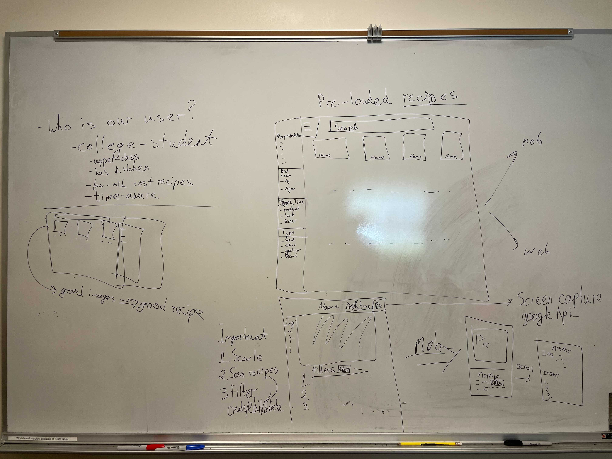

# Team Meeting
### Date: Oct 15, 2021. 2:00pm - 2:50pm
### Meeting method: in-person

#### Attendence:
Antonia  
David  
Dzhangir  
Jeremy  
Niya  
Ryan Heo  
Ryan Wang (joined around 2:20pm)  
Will  

#### Agenda:

1. Hammer Down who we are making this app for? (5min)
2. Knowing who the user is. What kinds of recipes would the users enjoy and how do we find those recipes (work for devs).
Discuss all together what the user may encounter while using the app, think about the user’s story. Record down on the whiteboard (or use a sticky note?). (15-20min)
3. Discuss all together what the user may encounter while using the app, think about the user’s story. Record down on the whiteboard (or use a sticky note?). (15-20min)
4. If those get too many. Get a vote on which one to be addressed in our app (on the whiteboard). (2min)
5. Four steps sketch (20min)
    1. Get some sheets and paper, write down everything that’s on your mind regarding the problem. Don't stop writing. Look at the most voted HMW. These notes are just for you, you won't share them with anyone. (6min)
    2. This is stressful but fun! (5min)
        - Fold a sheet of paper 4 times
        - Unfold to make a grid with 4 boxes
        - Quickly sketch 4 ideas in 5 minutes, one in each box.
        - You can try rapid variations of similar ideas.
        - Don't show it to anyone.
    3. Share the solution on the whiteboard. (5min)
    4. (If more time) Pick as many solutions as you like
    5. (If more time) Discuss 3-5min on the solutions that get the most pick
    6. (If more time) Vote on solutions to pick (everyone two votes)
6. Task out: Designer draw sketch design this weekend, others do more user research by looking into apps, devs built a workplace for html

#### Leftover from last meeting:
 - Intro Video
 - Team Contract Sign

#### New dishes in this meeting:

 - Decide our user to be college student
    - freshman lives on campus
 - Source of the recipe very important! Good recipe manager have good recipe
 - Accessibility
    - phone
    - print
    - voice?
 - Reload recipes, basic features
    - pictures in grid, good quality! enjoy reading
    - Filter list at left (responsive web dev)
        - allergy
        - Diet
        - Time (breakfast, lunch, dinner, etc)
        - Type (salad, entree, appetizer, dessert)
    - Search bar at top
 - Recipe Page
    - Name
    - Cook Time
    - Print (screen capture)
    - Ingredient bar at left (responsive web dev)
    - Filters
    - Responsive web dev? show all steps at one screen so no hand touch during cooking
    - Different prototype

#### Task assigned:
* A meeting with designers, a meeting with devs next week
* Intro video
* team contract
* team page

#### Comments & Questions:

##### Project Timeline

##### Any Decisions?
