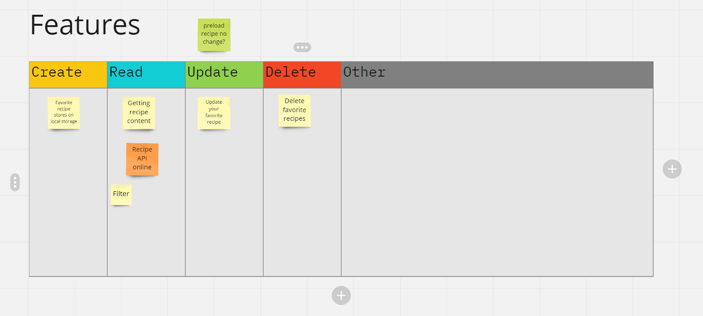
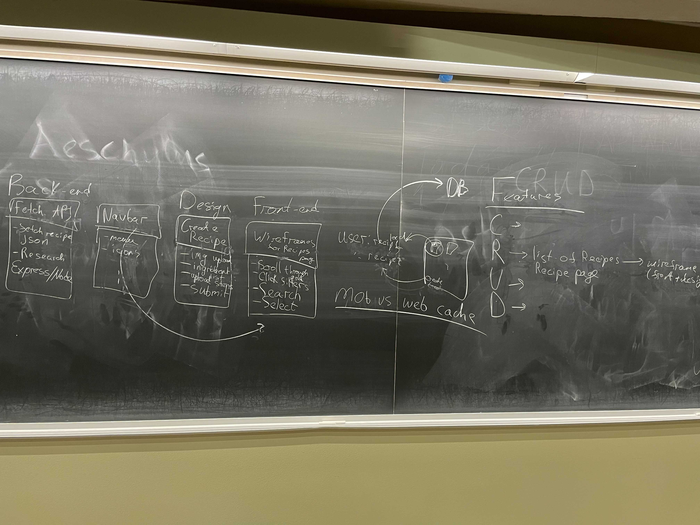

# Team Meeting
### Date: Oct 19, 2021. 4:00pm - 5:00pm
### Meeting method: zoom

#### Attendence:

#### Agenda:
1. Update about the meeting with the team, briefly said the info from the meeting, what TA told us, elaborate more on Friday meeting, and decide what feature to adopt on Friday.
2. Explain about Sprint process
3. Set goal:
      1. For the frontend, we want an HTML wireframe structure that we can build upon later. Make sure that we have a recipe pre-load page and a recipe viewing page. Make sure that if we make the window smaller, as in a mobile, things won’t blow up. Responsiveness in HTML and CSS.
      2. For the backend, we want to find and test several APIs based on the CRUD features. If we don’t need an API that is nice, if API can do it better then find one. You don’t need to integrate the API into the frontend yet, but built up individual features first, make sure that the thing is functioning. After the front-end completes HTML and designers get the design, we can integrate the individual unit into the web app later.
      3. Discuss what features we want to be in the app. (CRUD)

#### Leftover from last meeting:
N/A

#### New dishes in this meeting:
1. Show the agenda
2. Update about the meeting with TA, explaining idea about CRUD features
3. Dzhangir explain how sprint works
4. Decided to use the scrum board (https://trello.com/invite/b/d5jxgkDs/9b2c83c9f8a02439d128f1b74d0c53ab/productive-raccoons-scrum-board)
5. Discuss over miro board about CRUD features, but not going on very successfully. Decide to meet after class in-person

6. Meet in-person after class:

1. Explain about CRUD features
2. Front-end: create wireframe with the design team
3.  Back-end: Research about Express/Node, find recipe manager API
#### Task assigned:
1. Front-end: create wireframe with the design team
2. Back-end: Research about Express/Node, find recipe manager API
#### Comments & Questions:

##### Project Timeline

##### Any Decisions?
1. Use scrum (https://trello.com/invite/b/d5jxgkDs/9b2c83c9f8a02439d128f1b74d0c53ab/productive-raccoons-scrum-board)
