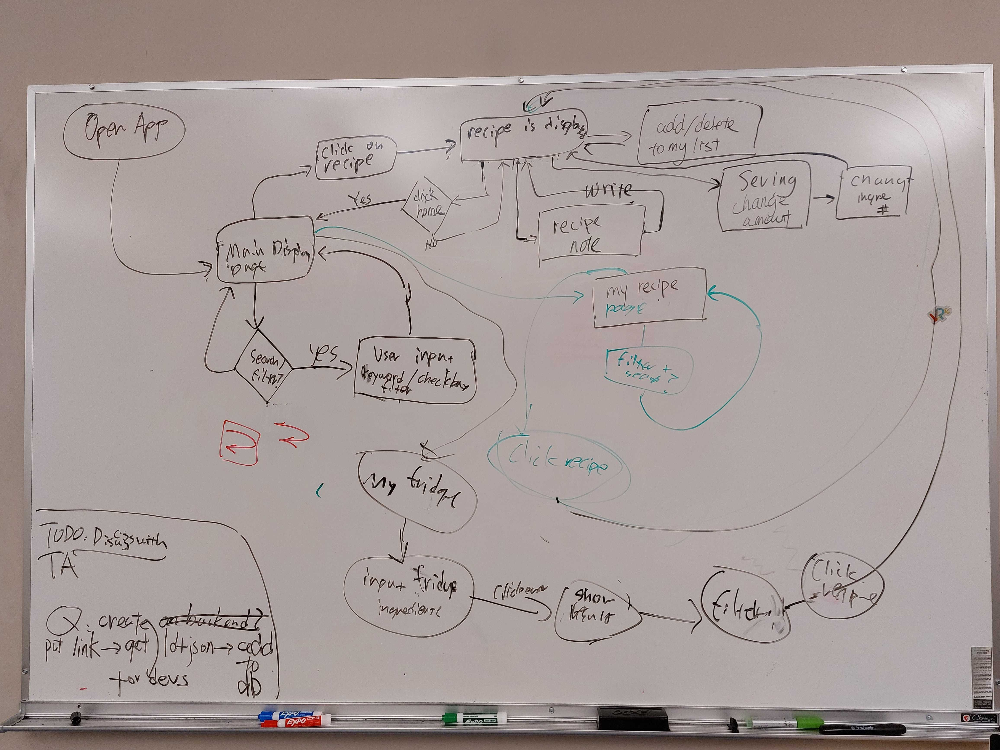

# Team Meeting
### Date: Oct 31, 2021. 5:00pm - 5:30pm
### Meeting method: zoom

#### Attendence:
Antonia  
David  
Dzhangir  
Jeremy  
Niya  
Richard  
Ryan Wang  
Ryan Helo (leaves early)  

#### Agenda:
1. General Status
2. Questions Posted in the design braintorming
3. Project Pitch

#### Leftover from last meeting:
N/A

#### New dishes in this meeting:
1. Questions posted in the design braintorming
    1. How does create by get link works? (https://spoonacular.com/food-api/docs#Extract-Recipe-from-Website) 
    2. How do we define the "maximum match" in the fridge feature ? (https://spoonacular.com/food-api/docs#Search-Recipes-by-Ingredients)
    3. Should we limit the number of ingredients user can input into fridge so that they are guided to be given a better result?
    4. Should search bar function has autocomplete? (https://spoonacular.com/food-api/docs#Autocomplete-Product-Search)
    5. 
2. Pitch
    1. general status update
    2. font size and type changes 
    3. send to TA Sanat

#### Task assigned:
* send pitch

#### Comments & Questions:
  
##### Project Timeline

##### Any Decisions?
* Define maximum match in fridge feature as minimum number of missing ingredients
* Search: just take it as a regular query call
