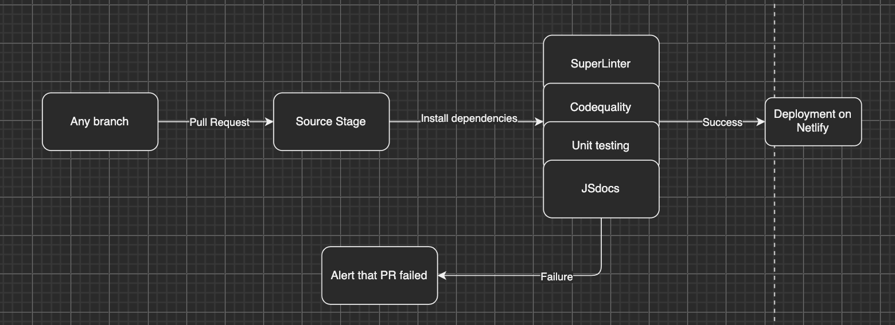
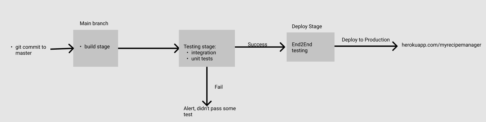

# CICD Pipeline

**Background:**

- The tool that we used for the CI/CD pipeline construction was Github Actions and for the configurations of the pipeline we have included all that in a yaml file

**Current Iteration:**

We have simplified our pipeline to only the most necessary and essential components. We got rid of a staging deployment stage and E2E testing just to make the pipeline shorter and more robust. While we would be sacrificing more comprehensive testing based on user interaction, given our time scope we felt it would be best to cut that out. We also got rid of a distinct deploy stage because we wanted to keep our deployment simple and to not add any further complications/infrastructure modifications to our deployment to a production environment to Netlify. Instead we modified it so that it would automatically deploy to netflix once all tests and code quality checks have passed on the main branch.

1. Any Pull Request attempting to merge with Main triggers our pipeline
  1. We also conduct human code reviews to uphold code quality and resolve merge conflicts
2. We install all the necessary dependencies:
  2. SuperLinter enforces code consistency in HTML, CSS, and JS
  3. Code Quality grades our code using CodeFactor
  4. Unit Testing is done with Jest to test API calls and isolated functions
  5. Documentation is generated for Javascript functions in source/documentation
3. On passing all tests and quality checks pipeline deploys to Netlify
4. On failure we alert the developers

**Past iteration** : Initially we had the idea and approach to set up two pipelines. (High fidelity old pipeline)
 
 The first pipeline consisted of:

- Source stage:
  - Triggered by any merge or PR to the main branch
- Build stage
  - Download any dependencies (jest) to make sure that all necessary dependencies are present to move further along pipeline
- Testing stage:
  - This stage consisted of primarily 3 things:
    - Code quality using eslint
    - Generating documentation
    - Unit and integration testing
  - If all the tests passed and all the code quality tests passed as well, then we constructed the pipeline to move onto the next stage (stage deployment) and if failed, it would stop the pipeline from further execution and alert the user regarding any failures through gmail
- Stage deploy:
  - We constructed a staging environment through a separate url to deploy to
  - Once deployment is complete, we would move on to next stage
- E2E Testing Stage:
  - This stage consisted of running E2E testing using Cypress on the deployed application on our staging environment
  - If all tests passed,we would deploy to production and if any failed we would end the pipeline execution and notify the respective user

**Future** :

- Some things that we would like to add in the future would be:
  - Adding a staging environment to conduct intensive integration testing and E2E testing
  - Add a distinct deployment stage to production and staging